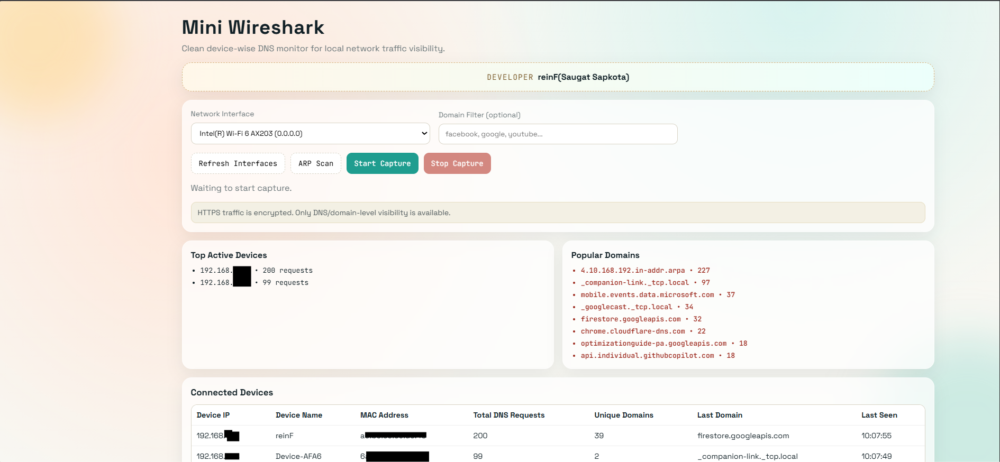
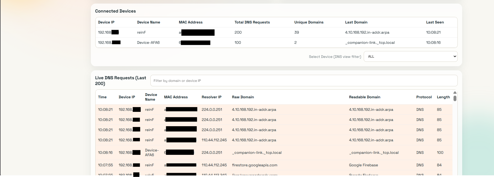

# Mini Wireshark DNS Monitor

A lightweight, educational network monitoring project that shows which local device is requesting which domain in real time.

This project focuses on DNS-level visibility, so you can understand device activity across your network without the complexity of full Wireshark workflows.

## Overview

- Stack: Python, Flask, Flask-SocketIO, Scapy, HTML/CSS/JavaScript
- Capture model: live packet sniffing with DNS parsing
- Visibility model: device IP + MAC + device name + domain request
- Interface support: Wi-Fi and Ethernet (auto-selected with Wi-Fi priority)

## Key Features

- Real-time DNS packet capture on selected interface
- Wi-Fi-first default interface detection (Wi-Fi/Wireless/WLAN fallback logic)
- Promiscuous mode capture for broader local visibility
- Device-wise monitoring:
  - Device Name
  - Device IP
  - Device MAC (when available)
  - Request history
- Domain intelligence:
  - Raw Domain
  - Cleaned Domain
  - Readable Domain label (friendly service name)
- Live dashboard sections:
  - Top Active Devices
  - Popular Domains
  - Connected Devices
  - Live DNS Requests (last 200)
- Filters:
  - Domain filter during capture
  - Device dropdown filter for DNS table
- Optional ARP scan for basic device discovery
- Debounced UI updates for smoother rendering

  ## Screenshots

The dashboard preview below uses your current project UI screenshots.






## Friendly Domain Mapping

Examples included in the parser:

- optimizationguide-pa.googleapis.com -> Google Optimization Service
- mobile.events.data.microsoft.com -> Microsoft Telemetry
- firestore.googleapis.com -> Google Firebase

Suffix mapping examples:

- googleapis.com -> Google Service
- facebook.com -> Facebook
- youtube.com -> YouTube
- microsoft.com -> Microsoft

## Project Structure

```text
backend/
  app.py
  sniffer.py
frontend/
  index.html
  style.css
  script.js
requirements.txt
README.md
```

## Setup

### Windows (PowerShell)

```powershell
python -m venv .venv
.\.venv\Scripts\Activate.ps1
.\.venv\Scripts\python -m pip install --upgrade pip
.\.venv\Scripts\python -m pip install -r requirements.txt
```

### Linux/macOS

```bash
python3 -m venv .venv
source .venv/bin/activate
python -m pip install --upgrade pip
pip install -r requirements.txt
```

## Run

From project root:

```powershell
.\.venv\Scripts\python .\backend\app.py
```

## Run TUI On Kali Linux

From project root:

```bash
source .venv/bin/activate
sudo .venv/bin/python backend/tui.py
```

Optional commands:

```bash
# List interfaces first
sudo .venv/bin/python backend/tui.py --list-interfaces

# Run with a specific interface
sudo .venv/bin/python backend/tui.py --interface wlan0

# Filter domains that contain text
sudo .venv/bin/python backend/tui.py --filter google
```

Tips:

- Use `Ctrl+C` to stop capture safely.
- Run with `sudo` on Kali for packet capture permissions.

Open in browser:

```text
http://localhost:5000
```


## Requirements and Permissions

- Run terminal as Administrator on Windows
- Use sudo/root where required on Linux/macOS
- Install Npcap on Windows
- Enable WinPcap compatibility mode during Npcap installation

## Important Limitation

HTTPS payload content is encrypted. This tool intentionally provides DNS/domain-level visibility, not full decrypted web traffic inspection.

## Educational Purpose

This is an educational mini-monitor designed to help learners understand real-time DNS activity and device behavior on local networks. It is not intended to replace enterprise packet analysis platforms.

## Developer

Developer: reinF - (Saugat Sapkota).

If this project helped you learn something new, that is the biggest success of this work.
